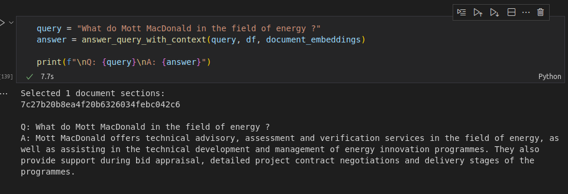
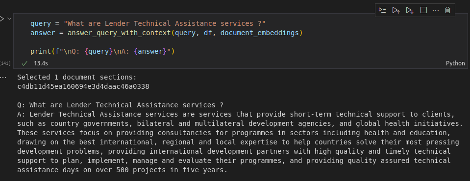
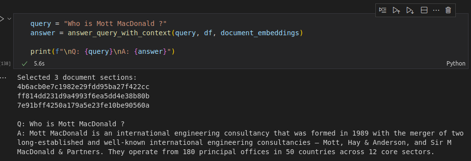
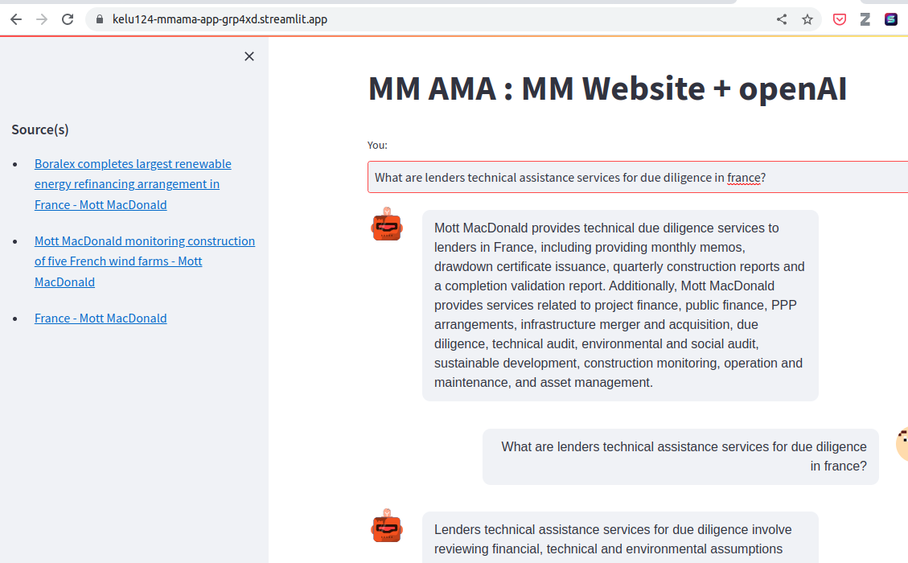

# Website_AMA

So .. stupid idea to help a friend .. can we do a chatbot to help them get information from a website with informatio spread across multiple page? Let's try and take 2h to tackle this

## [11:40] Start and background

Original idea of this - seems a mix of GPT3 and embedding would work to process large corpus of text.

[https://twitter.com/danshipper/status/1620464918515302401](https://twitter.com/danshipper/status/1620464918515302401)
[https://every.to/chain-of-thought/the-end-of-organizing](https://every.to/chain-of-thought/the-end-of-organizing)

I guess we'll be reusing this a lot too.

[https://github.com/openai/openai-cookbook/blob/main/examples/Question_answering_using_embeddings.ipynb](https://github.com/openai/openai-cookbook/blob/main/examples/Question_answering_using_embeddings.ipynb)

Application to a public website? We can. Let's start with the obvious sources of information, where to too and what not to do.

[https://www.mottmac.com/sitemap.xml](https://www.mottmac.com/sitemap.xml)

[https://www.mottmac.com/robots.txt](https://www.mottmac.com/robots.txt)

For cleaning and extracting text, apart from usual beautiful soup, I had heard about trafilatura.

[https://adrien.barbaresi.eu/blog/trafilatura-main-text-content-python.html](https://adrien.barbaresi.eu/blog/trafilatura-main-text-content-python.html)

Let's get going !

## [11:50] URLs cleared and processed

Output : [a cache folder](data/cache/). Gitignored here.

URLs captured in [here](data/pages.parquet.gzip)

## [12:00] Getting pages works! Onto getting text

Trafilatura seems easier than expected.

Text cleaned captured in [here](data/content.parquet.gzip)

## [12:05] Trying embedding.

First! Some commit.

[12:28] : adding metadata to the general dataframe

## [13:11] Embedding mechanisms saved

So let's take a break. Going to get the pages, run the embeddings, and we'll see what happens next. Counter on hold at 1h30.

+10mins: Articles selected, cleaned and processed. Launching embedding. Prepped the AskingQuestion tool.exist

+5mins: API seems to be unstable. Backing up regularly the embedding results

## [16:30] All done. 15mins spare.

## [16:46] What next ?

Streamlit app ?

https://medium.com/@avra42/build-your-own-chatbot-with-openai-gpt-3-and-streamlit-6f1330876846

## [18:45] Streamlit app deployed

It lives [there](https://kelu124-mmama-app-grp4xd.streamlit.app/) .

#### Demo:

